# Secure Industrial Messaging & Event Logging Platform


### **Real-Time Communication Architecture for Mission-Critical Operations**

---

## 📋 Table of Contents

- [Overview](#-overview)
- [System Architecture](#%EF%B8%8F-system-architecture)
- [Key Capabilities](#-key-capabilities)
- [Technical Stack](#%EF%B8%8F-technical-stack)
- [Technical Implementation](#-technical-implementation)
- [Installation & Deployment](#%EF%B8%8F-installation--deployment)
- [Usage](#-usage)
- [API Endpoints](#-api-endpoints)
- [License](#%EF%B8%8F-license)

---

## 📌 Overview

> **Architectural Overview:** A high-throughput, low-latency messaging backbone designed to facilitate secure communication between field operators (OT) and central management (IT). Built on asynchronous Python frameworks to handle concurrent connections with minimal overhead.

---

## 🏗️ System Architecture

This project demonstrates a full-stack implementation of a **Real-Time Event Driven Architecture**:

```mermaid
flowchart TB
    subgraph Client["🖥️ Client Layer"]
        React["React.js Dashboard"]
    end

    subgraph Transport["🔄 Transport Layer"]
        WS["WebSocket Connection"]
        HTTP["REST API"]
    end

    subgraph Server["⚙️ Server Layer"]
        FastAPI["FastAPI Application"]
        ConnMgr["Connection Manager"]
        Auth["JWT Authentication"]
    end

    subgraph Data["💾 Data Layer"]
        PostgreSQL["PostgreSQL Database"]
    end

    React <-->|"Real-time Messages"| WS
    React <-->|"HTTP Requests"| HTTP
    WS <--> ConnMgr
    HTTP <--> FastAPI
    ConnMgr <--> FastAPI
    FastAPI <--> Auth
    FastAPI <--> PostgreSQL
```



| Layer                    | Technology         | Function                                                  |
| :----------------------- | :----------------- | :-------------------------------------------------------- |
| **Data Plane (Backend)** | `FastAPI` (Python) | Asynchronous API handling & WebSocket management          |
| **Persistence Layer**    | `PostgreSQL`       | ACID-compliant storage for audit logs and message history |
| **Client Interface**     | `React.js`         | Responsive dashboard for operators                        |
| **Security**             | `JWT` & `Passlib`  | Stateless authentication & cryptographic password hashing |
| **Transport**            | `WebSockets`       | Full-duplex communication channels                        |

---

## ⚡ Key Capabilities

| Capability                     | Description                                                                                                                                          |
| :----------------------------- | :--------------------------------------------------------------------------------------------------------------------------------------------------- |
| **Zero-Latency Communication** | Utilizes **WebSockets** to deliver alerts, directives, and messages instantly, eliminating polling overhead found in traditional HTTP architectures. |
| **Stateless Security Model**   | Implements **JSON Web Tokens (JWT)** for secure, scalable session management without server-side storage bottlenecks.                                |
| **Audit-Ready Logging**        | Every interaction is timestamped and stored in structured SQL tables, ensuring full traceability for compliance (ISO/IEC standards).                 |
| **Concurrency**                | Leverages Python's `asyncio` to handle multiple simultaneous operator connections efficiently.                                                       |

---

## 🛠️ Technical Stack

| Category     | Technologies                                |
| :----------- | :------------------------------------------ |
| **Backend**  | Python 3.x, FastAPI, SQLAlchemy, Pydantic   |
| **Frontend** | React.js, Axios, React-Router, React-Icons  |
| **Database** | PostgreSQL (Relational Data Modeling)       |
| **DevOps**   | Docker support (Ready for containerization) |

---

## 📐 Technical Implementation

### Frontend Architecture

The React frontend implements a component-based architecture with the following key modules:

| Component    | File          | Purpose                                       |
| :----------- | :------------ | :-------------------------------------------- |
| **App**      | `app.js`      | Main routing configuration using React-Router |
| **Login**    | `login.js`    | User authentication with JWT token storage    |
| **Register** | `register.js` | New user registration flow                    |
| **Home**     | `home.js`     | Landing page with navigation                  |
| **Chat**     | `chat.js`     | Real-time messaging via WebSocket             |

<details>
<summary><strong>📜 Key Variables & Functions (Click to expand)</strong></summary>

```javascript
// Authentication (login.js)
const [username, setUsername] = useState("");
const [password, setPassword] = useState("");
const [errorMessage, setErrorMessage] = useState("");
const handleLogin = async (event) => {
  /* ... */
};
const navigateToRegister = () => {
  /* ... */
};

// Chat Component (chat.js)
const [messageList, setMessageList] = useState([]);
const [userList, setUserList] = useState([]);
const [chatUserList, setChatUserList] = useState([]);
const [onlineUserList, setOnlineUserList] = useState([]);
const webSocketRef = useRef(null);
const fetchMessagesWithUser = async (recipientId, recipientUsername) => {
  /* ... */
};
const sendMessage = async () => {
  /* ... */
};
const handleLogout = () => {
  /* ... */
};
```

</details>

#### Frontend Dependencies

| Package            | Purpose                                                                           |
| :----------------- | :-------------------------------------------------------------------------------- |
| `react-router-dom` | Client-side routing                                                               |
| `axios`            | HTTP client for API requests                                                      |
| `react-icons`      | UI icon library (FaUser, FaSignOutAlt, FaComments, FaPaperPlane, FaGlobeAmericas) |
| `web-vitals`       | Performance metrics reporting                                                     |

### Backend Architecture

The FastAPI backend implements a modular architecture with the following components:

| Module       | File          | Purpose                                        |
| :----------- | :------------ | :--------------------------------------------- |
| **Main**     | `main.py`     | API endpoints, WebSocket handling, CORS config |
| **Auth**     | `auth.py`     | JWT token generation, password hashing         |
| **CRUD**     | `crud.py`     | Database operations for users and messages     |
| **Models**   | `models.py`   | SQLAlchemy ORM models (User, ChatMessage)      |
| **Database** | `database.py` | PostgreSQL connection and session management   |

<details>
<summary><strong>📜 Key Classes & Functions (Click to expand)</strong></summary>

```python
# WebSocket Connection Manager (main.py)
class ConnectionManager:
    """Manages WebSocket connections for real-time messaging."""
    active_connections: dict[int, dict]  # user_id -> {"username", "websocket"}
    async def connect(user_id, username, websocket)
    def disconnect(user_id)
    async def send_personal_message(message, recipient_id, db)

# Authentication (auth.py)
def create_access_token(data, expires_delta)  # Generate JWT token
def get_current_user(token)                   # Validate and decode JWT
def get_password_hash(password)               # Hash password with bcrypt
def verify_password(plain, hashed)            # Verify password

# CRUD Operations (crud.py)
def create_user(db, user)                     # Register new user
def get_user(db, username)                    # Find user by username
def create_chat_message(db, sender_id, receiver_id, content)
def get_chat_users(db, user_id)               # Get users with message history
def get_chat_messages(db, current_user_id, target_user_id)
```

</details>

#### Backend Dependencies

| Package       | Purpose                                         |
| :------------ | :---------------------------------------------- |
| `fastapi`     | Async web framework with automatic OpenAPI docs |
| `uvicorn`     | ASGI server for running FastAPI                 |
| `sqlalchemy`  | ORM for PostgreSQL database operations          |
| `pydantic`    | Data validation and serialization               |
| `python-jose` | JWT token encoding/decoding                     |
| `passlib`     | Password hashing with bcrypt                    |

---

## 🔌 API Endpoints

| Method | Endpoint            | Description                                |
| :----- | :------------------ | :----------------------------------------- |
| `GET`  | `/`                 | Welcome endpoint                           |
| `POST` | `/users/`           | Create a new user account                  |
| `GET`  | `/users/`           | Retrieve all registered users              |
| `GET`  | `/users/{username}` | Find user by username                      |
| `POST` | `/token`            | Authenticate and get JWT token             |
| `POST` | `/messages/`        | Send a new chat message                    |
| `GET`  | `/messages/`        | Retrieve message history between users     |
| `GET`  | `/users/chat/`      | Get users with existing chat history       |
| `GET`  | `/online-users/`    | Get currently online users                 |
| `WS`   | `/ws/{username}`    | WebSocket endpoint for real-time messaging |

---

## 🚀 Usage

### Operational Use Case

| Aspect       | Description                                                                                                                                                             |
| :----------- | :---------------------------------------------------------------------------------------------------------------------------------------------------------------------- |
| **Scenario** | An "Alert" from a SCADA system needs to be discussed immediately between the Field Engineer and the Control Room.                                                       |
| **Solution** | This platform bridges the gap, allowing secure, logged, and instant text-based coordination, replacing insecure consumer apps like WhatsApp in industrial environments. |

```mermaid
sequenceDiagram
    participant FE as 👷 Field Engineer
    participant Platform as 🖥️ Messaging Platform
    participant DB as 💾 PostgreSQL
    participant CR as 🏢 Control Room

    FE->>Platform: Login (JWT Auth)
    Platform->>DB: Validate Credentials
    DB-->>Platform: Auth Success
    Platform-->>FE: Access Token

    FE->>Platform: Send Alert Message (WebSocket)
    Platform->>DB: Store Message
    Platform->>CR: Real-time Notification
    CR->>Platform: Send Response
    Platform->>DB: Store Response
    Platform->>FE: Real-time Response
```



---

## ⚙️ Installation & Deployment

### Prerequisites

- Python 3.x
- Node.js & npm
- PostgreSQL database

### Database Setup

```sql
CREATE DATABASE chattin_db;
CREATE USER chattin WITH PASSWORD '1234';
ALTER ROLE chattin SET client_encoding TO 'utf8';
ALTER ROLE chattin SET default_transaction_isolation TO 'read committed';
ALTER ROLE chattin SET timezone TO 'UTC';
GRANT ALL PRIVILEGES ON DATABASE chattin_db TO chattin;
```

### Quick Start

```bash
# Clone the repository
git clone https://github.com/isikmuhamm/secure-industrial-messaging-platform.git
cd secure-industrial-messaging-platform

# Backend Setup (FastAPI)
cd backend
pip install -r requirements.txt
uvicorn main:app --reload

# Frontend Setup (React) - In a new terminal
cd frontend
npm install
npm start
```

> 💡 **Tip:** Backend runs on `http://localhost:8000` | Frontend runs on `http://localhost:3000`

---

## ⚖️ License

This project is licensed under the **MIT License**.

_Designed as a Proof-of-Concept (PoC) for secure internal communication protocols within restricted industrial networks._

---

<div align="center">

_Secure Industrial Messaging Platform © 2026_

[](https://github.com/isikmuhamm/secure-industrial-messaging-platform)

</div>
